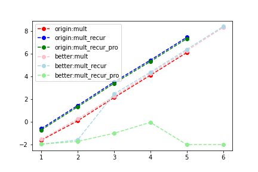

# Big Integer Multiplication

说明文档中文版（Readme Chinese Version）在[这里](readme.md)。

## Directory

```sh
$ tree
.
├── Cargo.toml
├── datas
│   ├── data1.csv
│   └── data2.csv
├── draw.py
├── examples
│   ├── bad_case.rs
│   └── rand_case.rs
├── readme.md
├── readme_cn.md
├── results
│   ├── result1.svg
│   ├── result1_py.png
│   ├── result2.svg
│   ├── result2_py.png
│   └── result_cmp_py.png
├── src
│   ├── big_integer.rs
│   ├── bin
│   │   ├── draw.rs
│   │   └── old.rs
│   ├── lib.rs
│   └── main.rs
└── tests
    └── mult_tests.rs
```

## Experimental Setting

| Sortware/Hardware |      Version      |
| :---------------: | :---------------: |
|        OS         | Linux/Ubuntu20.04 |
|        RAM        |       64GB        |
|        CPU        |                   |
|        Vim        |     8.1.2269      |
|    Rust(rustc)    |      1.61.0       |
|       Cargo       |      1.61.0       |

## Program Running

### Download

```sh
git clone https://github.com/furtherun/big-integer-multiplication
```

### Compile with Cargo

```sh
cd big-integer-multiplication
cargo build --release
```

### Run an Example

```sh
cargo run --example rand_case
```

This example randomly generates two 10-digits large integers,
multiplies them in three ways, and prints the result.

```output
x = 2010695756, y = 3273900753
2010695756*3273900753
res1=6582818349622304268
res2=6582818349622304268
res3=6582817397422304268
```

### Run Experiment

```sh
cargo run --bin big_int_mult
```

If you see text like this in a command-line window,
the program is simulating the big integer multiplication.

```output
Big integer length = 10 generated.
mult takes 0.038 ms, mult_recur takes 0.124 ms, mult_recur_pro takes 0.019 ms
Big integer length = 10 finished.
Big integer length = 100 generated.
mult takes 1.909 ms, mult_recur takes 0.475 ms, mult_recur_pro takes 0.026 ms
Big integer length = 100 finished.
Big integer length = 1000 generated.
mult takes 187 ms, mult_recur takes 420 ms, mult_recur_pro takes 0.112 ms
...
```

The run time datas are save in directory `/datas`.

### Drawing

```sh
cargo run --bin draw
```

And the result drawings are save in directory `/results`.
However, Rust drawing is less than ideal now,
so code by Python is given for drawing,
and you can be run `draw.py` after getting the data.

## Result Show



## Outdated methods

```sh
cargo run --bin old
```

The unoptimized method runs much slower compared to the optimized method.

## Still Bugs

1. `test_mult_recur()` can not pass;
2. `mult_recur_pro()` sometimes will caculate wrong answer, such as in
`cargo run --example bad_case`, some digit in middle of res3 is wrong。
