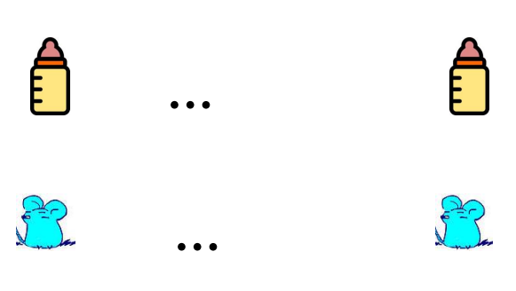
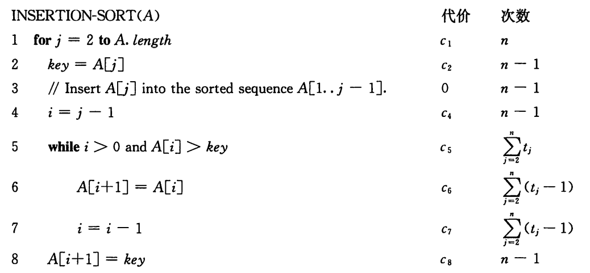
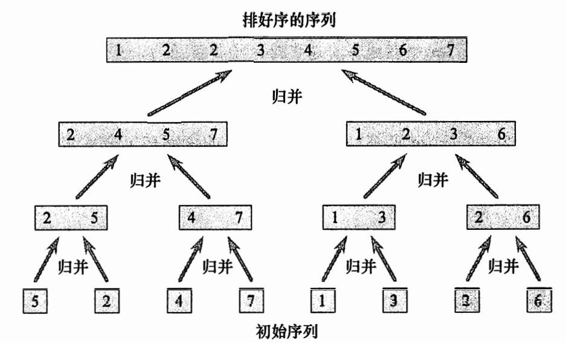

# 算法分析

## 算法

算法 (algorithm) 就是任何良定义的计算过程，该过程取某个值或值的集合作为
输入并产生某个值或值的集合作为输出。这样算法就是把输入转换成输出的计算步骤的一个
序列。

算法是一个计算步骤的序列，用以将输入转换为输出。

~~想到了体检时阿姨问我什么叫算法~~，必考。

## 检测有毒药的水瓶

有1000瓶水，其中有一瓶有毒，小白鼠只要尝一点带毒的水24小时后就会死亡。
至少要多少只小白鼠才能在24小时时鉴别出那瓶水有毒？



1. 直观的想法：一只老鼠喝一瓶水，需要1000只老鼠；
2. 稍有改进的想法：只需要999只老鼠，如果没有老鼠死亡，则是没有喝的那一瓶。

问题转换：如何从0～999中找到特定的数字？

使用二分法，则至少需要$\lfloor \log_2 n \rfloor$只老鼠，但需要10天的时间。
在二分法查找过程中，10只老鼠需要按序进行喝水。

考虑采用**编码**的方式来求解，先考虑一个小规模问题。
假设有编号为0~7的八个水瓶，其中只有一瓶中装有毒药，我们按照二进制编码方式，
八个水瓶的标签分别为，

| 水瓶  | 编号  |
| :---: | :---: |
|   0   |  000  |
|   1   |  001  |
|   2   |  010  |
|   3   |  011  |
|   4   |  100  |
|   5   |  101  |
|   6   |  110  |
|   7   |  111  |

每只老鼠按照二进制编号的列，如果为1，则喝该水瓶中的水，否则不喝。
例如，第一只老鼠所对应的列为`0000 1111`，所以它只喝后四瓶水，也就是编号为4、5、6和7的水瓶。

如果编号为2的水瓶有毒，那么只有第二只老鼠会死亡。
如果第一只和第二只老鼠都死亡，那么说明编号为6的水瓶有毒。
这样，通过编号与水瓶的对应，可以判断哪些老鼠死亡时，是哪一杯水有毒。

从使用编码解决问题的过程中，学到了两点：

1. 复杂问题可以先从简单方法入手；
2. 大规模问题可以先从小规模试解。

## 最大公约数

### 欧几里得算法

```rust
fn gcd(a: i32, b: i32) {
   match b {
      0 => a,
      - => gcd(b, a%b),
   }
}
```

### 连续整数检测算法

```rust
fn gcd(a: i32, b: i32) {
   let t = min(a, b);
   while a%t != 0 && b%t != 0 {
      t -= 1;
   }
   t
}
```

### 质因数法

找到$a$和$b$所有的质因数；如果$p$是公因数，那么在结果中$p$将重复$\min{pa, pb}$次。
其中$pa$和$pb$分别为$p$在$a$和$b$的因式中出现的次数。

例如，

$$
60 = 2 \times 2 \times 3 \times 5 \\
24 = 2 \times 2 \times 2 \times 3 \\
$$

因此有，

$$
gcd(60, 24) = 2\times 2 \times 3 = 12
$$

## 插入排序

插入排序在数组 A=<5, 2, 4, 6, 1, 3>上的执行过程。


插入排序算法，逐行分析。


## 归并排序

归并排序在数组 A=<5, 2, 4, 7, 1, 3, 2, 6〉上的操作。



>描述一个运行时间为$\Theta(n \log n)$的算法，给定$n$个整数的集合$S$和另一个整数$x$,
该算法能确定$S$中是否存在两个其和刚好为$x$的元素。

LeetCode经典题目，[两数之和](https://leetcode.cn/problems/two-sum/)。

1. 排序后使用双指针查找；
2. 借助hashmap。

## 斯特林（Stirling）近似公式

$$
n! = \sqrt{2 \pi n} \big(\frac{n}{e}\big)^n \bigg(1+\Theta(\frac{1}{n})\bigg)
$$

推论：

$$
n! = o(n^n)
$$

$$
n! = \omega (2^n)
$$

$$
\lg (n!) = \Theta(n \lg n)
$$

多项式边界（polynomially bounded）

Proving that a function $f(n)$ is polynomially bounded is equivalent to proving that
$\lg( f (n)) = O(\lg n)$ for the following reasons.

- 如果$f$有多项式边界，那么存在$f(n) \le cn^k$，进而有$\lg(f(n)) \le k c \lg n$，
即$\lg(f(n)) = O(\lg n)$；
- 同理，如果$\lg(f(n)) = O(\lg n)$，那么$f$就有多项式边界。
